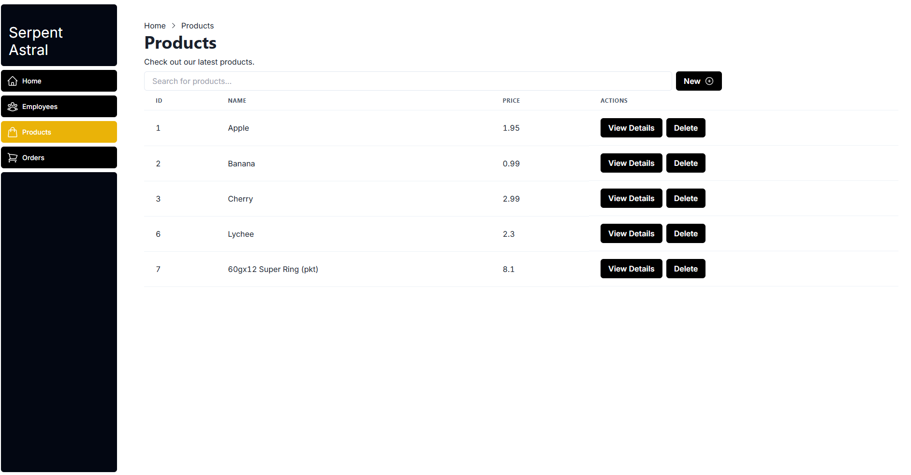
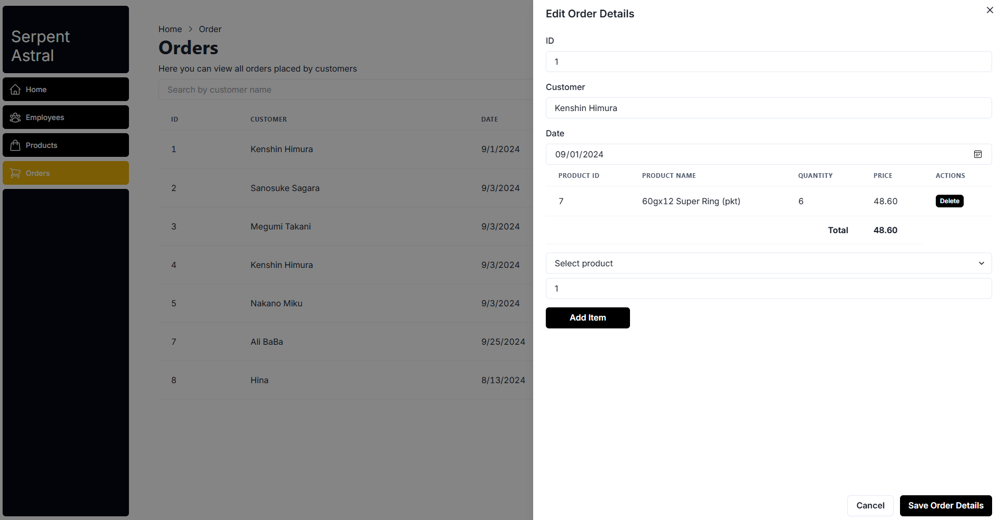

# 🌏 Spectral Astral - An Order Processing Solution <!-- omit in toc -->


Welcome to Spectral Astral, a web solution to speed up order processing in small and medium goods trading warehouses in Malaysia with [Prisma](https://www.prisma.io/), [NextJS](https://nextjs.org/), [GraphQl-Yoga](https://the-guild.dev/graphql/yoga-server) and [SQLite](https://www.sqlite.org/index.html) database. The UI for the page is powered by [Tailwind CSS](https://tailwindcss.com/) and [Chakra UI](https://v2.chakra-ui.com/).

The project aims to speed up order processing which traditionally done on paper by salesman where a lot of writing is involved. By digitalizing the company product catalogue and order creation, it saves time and effort to handle customers order and it improve the efficiency of business. Moreover, it serves as the foundation for to embrace a more advanced digital adoption across business such as e-invoice generation, logistic planning and warehouse optimization.

**Table of Contents:**

- [Getting Started ⚡](#getting-started-)
- [Demonstration 💫](#demonstration-)
- [CRUD 🔨](#crud-)
- [Progress 🪫](#progress-)
  - [System Gen 1.0 Roadmap](#system-gen-10-roadmap)
  - [System Gen 2.0 Raodmap](#system-gen-20-raodmap)
- [License 💳](#license-)
- [Inspiration 💡](#inspiration-)


## Getting Started ⚡

After Git clonning,

```bash
npm run dev
```

You can also use my script for fast deployement, make sure your Prisma is configured first:

```bash
./npm_auto.sh
```

## Demonstration 💫





## CRUD 🔨

Here's how the CRUD process works, basicallt it involves several layers of communication. I choose GraphQl-Yoga as it is much easier to set up.


## Progress 🪫

### System Gen 1.0 Roadmap

Performs CRUD on employees data. The UIs includes features such as pagination, items per page, drawers and also data post-CRUD data refresh. There are a lot of learnings in this stage from planning to designing until deployment. It's never easy for such a massive project.

### System Gen 2.0 Raodmap

Order creation, simple order setup. Search and query optimizatino. 

## License 💳

[](https://www.gnu.org/licenses/gpl-3.0)

## Inspiration 💡

The project aims to study the inventory management system 😆. I am quite inspired by Manhwa with all the overpowered system, so I kinda bring their concepts to create this shop. 

