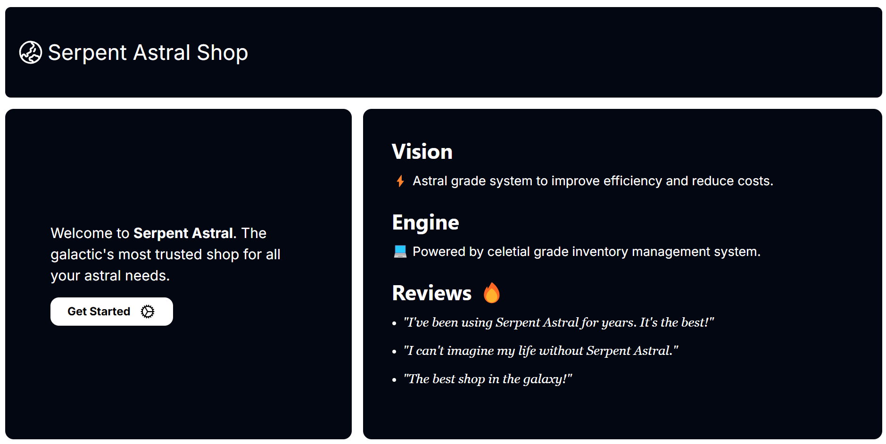
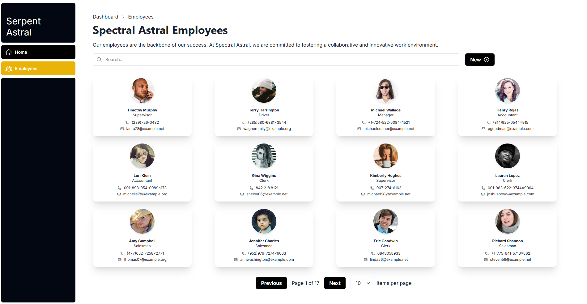
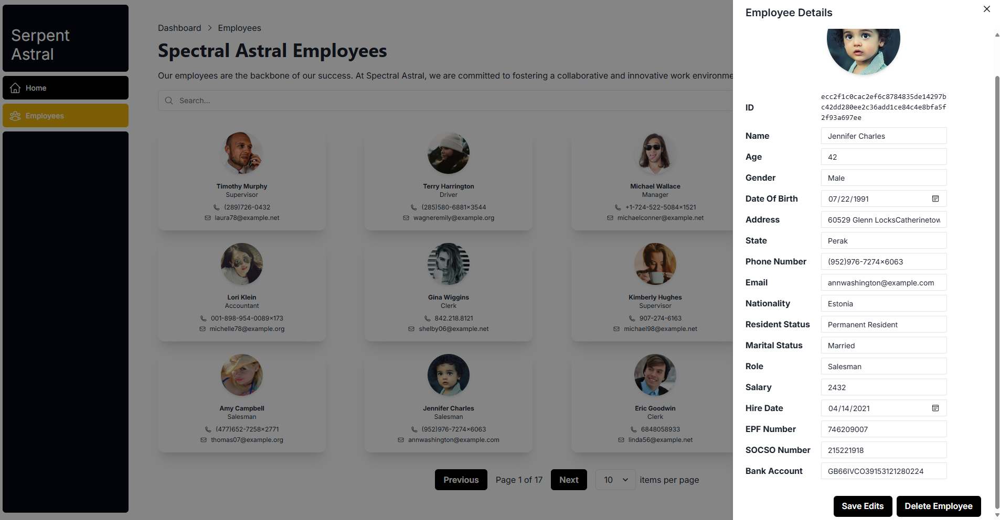

# 🌏 Spectral Astral Shop

> **Warning**
> Spectral Astral Gen 2.0 maintainance ongoing👷‍♂️


Welcome to Spectral Astral, the galactic most trusted shop for your Astral's need. This is not a galactic scale trading application but a **hobby project** to learn how to set up a simple shop system with [Prisma](https://www.prisma.io/), [NextJS](https://nextjs.org/), [GraphQl-Yoga](https://the-guild.dev/graphql/yoga-server) and [SQLite](https://www.sqlite.org/index.html) database. The UI for the page is powered by [Tailwind CSS](https://tailwindcss.com/) and [Chakra UI](https://v2.chakra-ui.com/).

The data from the database is generated by Python [Faker library](https://faker.readthedocs.io/en/master/index.html). You can learn more about the generation process [here](https://github.com/keanteng/trading-database).

A shop system is massive CRUD processes at work, I plan to learn most of the functions to make it work from populating the databases to display the data then with user interacting with it - a monumental feat!

## Getting Started ⚡

After Git clonning,

```bash
npm run dev
```

You can also use my script for fast deployement, make sure your Prisma is configured first:

```bash
./npm_auto.sh
```

## Demonstration 💫





## CRUD 🔨

Here's how the CRUD process works, basicallt it involves several layers of communication. I choose GraphQl-Yoga as it is much easier to set up.


## Progress 🪫

### System Gen 1.0 Roadmap

Performs CRUD on employees data. The UIs includes features such as pagination, items per page, drawers and also data post-CRUD data refresh. There are a lot of learnings in this stage from planning to designing until deployment. It's never easy for such a massive project.

### System Gen 2.0 Raodmap

Order creation. Search and query optimizatino

## License 💳

[](https://www.gnu.org/licenses/gpl-3.0)

## Inspiration 💡

The project aims to study the inventory management system 😆. I am quite inspired by Manhwa with all the overpowered system, so I kinda bring their concepts to create this shop. 

